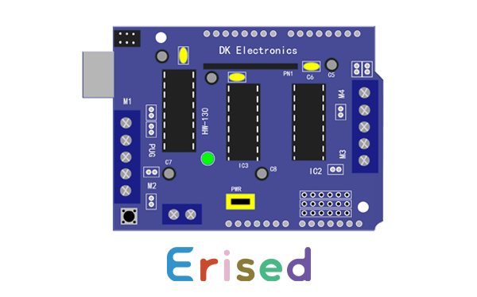
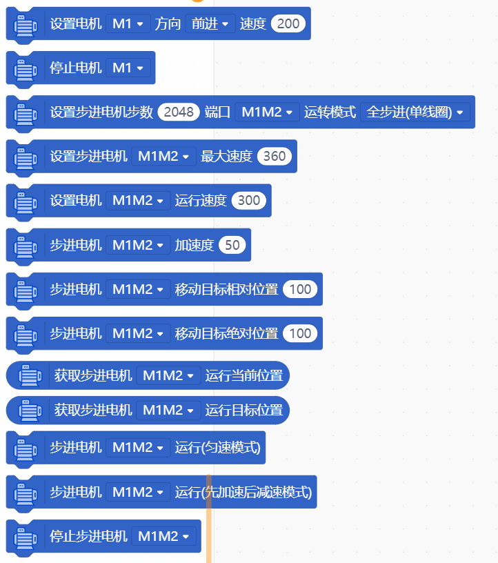
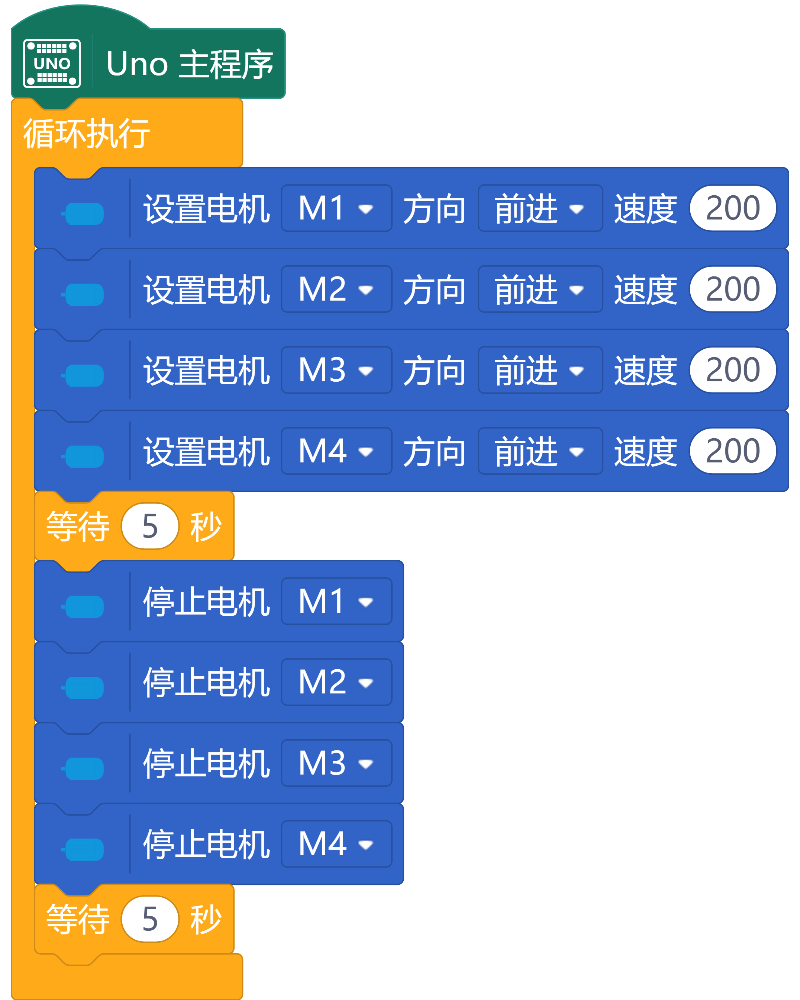
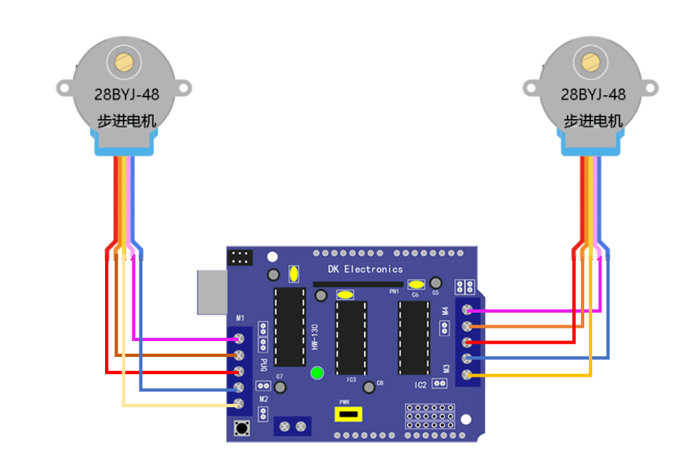
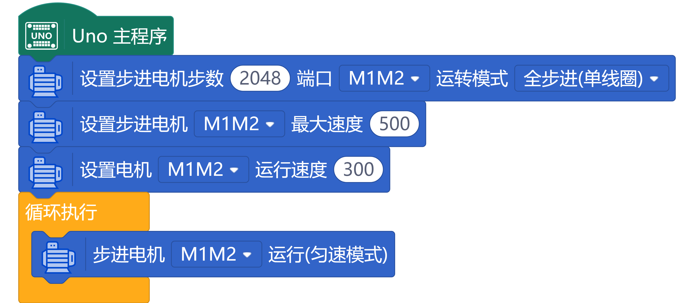

# AFMotor 电机驱动扩展




---------------------------------------------------------

## 目录

* [相关链接](#相关链接)
* [支持列表](#支持列表)
* [介绍](#介绍)
* [积木列表](#积木列表)
* [示例程序](#示例程序)
* [许可证](#许可证)
* [更新记录](#更新记录)

## 相关链接
* 本项目加载链接: ```https://gitee.com/hockel/AFMotor```
* 4*4 矩阵键盘链接：```https://gitee.com/hockel/Keypad```
* 用户库教程链接: ```https://mindplus.dfrobot.com.cn/extensions-user```
* 购买此产品: [某宝]([https://s.taobao.com/search?q=%E5%85%BC%E5%AE%B9Arduino+%E7%94%B5%E6%9C%BA%E9%A9%B1%E5%8A%A8%E6%89%A9%E5%B1%95%E6%9D%BF+motor+control+shield+L293D+%E9%A9%AC%E8%BE%BE%E6%9D%BF&imgfile=&js=1&stats_click=search_radio_all%3A1&initiative_id=staobaoz_20200702&ie=utf8](https://s.taobao.com/search?q=兼容Arduino+电机驱动扩展板+motor+control+shield+L293D+马达板&imgfile=&js=1&stats_click=search_radio_all%3A1&initiative_id=staobaoz_20200702&ie=utf8)).

## 支持列表

| 主板型号  | 实时模式 | ArduinoC | MicroPython | 备注 |
| --------- | :------: | :------: | :---------: | ---- |
| micro:bit |          |    √     |             |      |
| mpython   |          |    √     |             |      |

## 介绍

#### AFMOTOR电机扩展板主要功能特点：

- 可最多驱动4个模型直流电机
- 可最多驱动2个28BYJ-48步进电机
- 可最多驱动2个舵机（伺服电机）通过Arduino的9号和10号引脚来驱动舵机。
- 板载两块L293D芯片负责电机驱动的核心工作
- 可配合Arduino Uno/Mega开发板使用（扩展主要针对Uno开发板进行开发）

#### 外接电源电压要求

AFMotor扩展板中起关键作用的芯片是L293D。该芯片所允许的直流电源电压范围是4.5V ～25V。因此AFMotor扩展板外接电源接口允许我们连接的电源也是4.5V ～25V。请注意：这是一个很宽泛的电压指标。具体我们应该连接的电源电压有多大，这是由被驱动的电机工作电压来决定的。

#### 工作运行时AFMOTOR电机扩展板使用方法：

一般在正常工作状态下，Arduino开发板是不会与电脑通过数据线进行连接的。这时我们就要通过AFMotor电机扩展板上外接电源端口同时为扩展板和Arduino供电。

***注意：当使用外接电源同时为Arduino和电机扩展板供电时，扩展板上的跳线必须安置在插针上。否则Arduino是无法工作的。***

#### 扩展板跳线的作用

在以上两种工作方式里，我们对电机扩展板上的跳线采取了不同的操作方法。该跳线的作用是控制Arduino开发板是否通过外接电源来供电。当跳线移除的时候，外接电源不会为Arduino开发板供电。相反当跳线安置在插针上，外接电源将会为Arduino供电。

因此在程序开发过程中，当Arduino与电脑通过USB线连接时，我们需要将跳线从插针上移除。假如我们不移除该跳线，Arduino会有两路供电。而这两路电源同时工作会产生问题，严重的可能会造成开发板以及扩展板的损坏。

#### 未占用引脚

Arduino引脚2 和引脚13都没有被AFMotor电机扩展板所占用。如果您手中有AFMotor扩展板，您可以在扩展板的正面靠近2号引脚的位置找到一个没有焊接插针的预留孔。这个预留孔就是用于焊接额外插针以便于您使用引脚2的。与上面所提到的模拟引脚一样，引脚2预留孔也没有预先焊好插针。如果要用到此引脚，需要您自行焊接插针。

引脚13虽然没有被AFMotor扩展板占用，但是扩展板上没有将该引脚引出。使用引脚13需要您自行焊接额外引线才能使用。

​                                                                                                                                                        (--转自[太极创客网站](http://www.taichi-maker.com/homepage/reference-index/motor-reference-index/arduino-motor-shield/)）

## 积木列表



## 示例程序

###  示例一、驱动四个电机的运动




### 示例二、驱动步进电机程序

#### 电路连接图：



#### 程序代码：



## 许可证

MIT


## 更新日志
* V0.0.1  基础功能完成

  